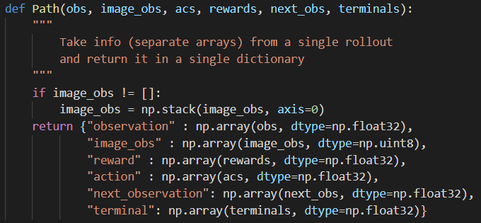

## Behavioral Cloning/pytorch

#### **1.完成code**

- **scripts/run_hw1.py** 

  主程序

  - BC_Trainer()

    params['agent_class']=BCAgent

    rl_trainer=RL_Trainer()

  - run_training_loop()

    rl_trainer.tun_training_loop()

- **infrastructure/rl_trainer.py**

  - env=gym.make(self.params['env_name'])

  - agent=BCAgent(env,params)

    ----itr----

  - collect_training_trajectories()

    不做DAgger，直接用专家轨迹

    ```python
    if (itr == 0):
        loaded_paths = pickle.load(open(load_initial_expertdata, "r"))
        return loaded_paths, 0, None
    ```

    做DAgger，需要重新根据专家policy采数据

    ```python
    # TODO collect `batch_size` samples to be used for training
    paths, envsteps_this_batch = utils.sample_trajectories(
                self.env, collect_policy, batch_size, self.params['ep_len'])
    ```

  - do_relabel_with_expert()

    ```python
    # TODO relabel collected obsevations (from our policy) with labels from an expert policy
    for i in paths:
        i['action']=expert_policy.get_action(i['observation'])
    ```

  - agent.add_to_replay_buffer()

  - train_agent()

    ```python
    # TODO sample some data from the data buffer
    ob_batch, ac_batch, re_batch, next_ob_batch, \
                terminal_batch = self.agent.sample(self.params['train_batch_size'])
    ```

    ```python
    # TODO use the sampled data to train an agent
    train_log = self.agent.train(ob_batch, ac_batch,
                                             re_batch, next_ob_batch, terminal_batch)
    ```

- **agents/bc_agent.py **

  - actor=MLPPolicySL()

  - replay_buffer=ReplayBuffer()

  - train()

    actor.update(obs,act)

  - add_to_replay_buffer()

    replay_buffer.add_rollouts(paths)

- **policies/MLP policy.py**

  - logits_na

  - mean_net、logstd

  - get_action(obs)

    ```python
    def get_action(self, obs: np.ndarray) -> np.ndarray:
        obs = np.array(obs)
        if len(obs.shape) > 1:
            observation = obs
            else:
                observation = obs[None]
    
                # TODO return the action that the policy prescribes
                #需要传入tensor
                actions = self(ptu.from_numpy(observation))
                # print("actions:", actions)
                #从action中采样
                if (self.discrete):
                    action = np.argmax(ptu.to_numpy(actions), axis=1) #离散动作取最大概率
                    else:
                        action = actions+torch.tensor(
                            np.exp(ptu.to_numpy(self.logstd)) *
                            np.random.normal(loc=0, scale=1,size=actions.shape[1])).cuda()
                        action = ptu.to_numpy(action) #连续动作从分布中采样
                        return action
    ```

  - update(obs,act)

    ```python
    def update(
        self, observations, actions,
        adv_n=None, acs_labels_na=None, qvals=None):
        # TODO: update the policy and return the loss
        loss = self.loss(ptu.from_numpy(actions),
                         ptu.from_numpy(self.get_action(observations)))
        self.optimizer.zero_grad()#loss默认requires_grad是false
        loss = loss.requires_grad_()
        loss.backward()
        self.optimizer.step()
        return {
            # You can add extra logging information here, but keep this line
            'Training Loss': ptu.to_numpy(loss),
        }
    ```

  - forward(obs)

    ```python
    # This function defines the forward pass of the network.
    def forward(self, observation: torch.FloatTensor) -> Any:
        input = observation
        if (self.discrete):
            output = self.logits_na(input)
            else:
                output = self.mean_net(input)
                return output
    ```

    

- **infrastructure/replay_buffer.py**

  - paths：保存所有轨迹；obs、acs、rews、next_obs、terminals

  - add_rollouts()

    向字段中添加轨迹

  - sample_random_data()

    np.random.permutation：乱序生成x维list，或将list打乱

    ```python
    ## TODO return batch_size number of random entries from each of the 5 component arrays above
    batch = np.random.permutation(self.obs.shape[0])
    batch = batch[:batch_size]
    return ([self.obs[batch], self.acs[batch], self.rews[batch],
             self.next_obs[batch], self.terminals[batch]])
    ```

  - sample_recent_data()

-  **infrastructure/utils.py**

  - sample_trajectories()

    至少取min_timesteps_per_batch个(s,a)

    ```python
    #Collect rollouts until we have collected min_timesteps_per_batch steps.
    imesteps_this_batch = 0
    paths = []
    while timesteps_this_batch < min_timesteps_per_batch:
        p = sample_trajectory(env, policy, max_path_length, render, render_mode)
        paths.append(p)
        timesteps_this_batch += get_pathlength(p)
    return paths, timesteps_this_batch
    ```

  - sample_n_trajectories()

    ```python
    #Collect ntraj rollouts.
    paths = []
    for i in range(ntraj):
    	p = sample_trajectory(env, policy, max_path_length, render, render_mode)
    	paths.append(p)
    return paths
    ```

-  **infrastructure/pytorch_utils.py**

  nn.Sequential(*layers)：输入orderdict或一系列model

  传入实参时，加上*可将列表拆成一个个元素

  ```python
  # TODO: return a MLP. This should be an instance of nn.Module
  # Note: nn.Sequential is an instance of nn.Module.
  fc = []
  fc.append(nn.Linear(input_size, size))
  fc.append(activation)
  for i in range(n_layers-1):
      fc.append(nn.Linear(size, size))
      fc.append(activation)
  fc.append(nn.Linear(size, output_size))
  fc.append(output_activation)
  return nn.Sequential(*fc)
  ```

- 运行：

  ```bash
  python run_hw1.py --expert_policy_file ../policies/experts/Ant.pkl --env_name Ant-v2 --exp_name bc_agent --n_iter 1 --expert_data ../expert_data/expert_data_Ant-v2.pkl
  ```

  结果：

  ```bash
  ########################
  logging outputs to  /home/CS285/hw1/cs285/scripts/../../data/q1_bc_ant_Ant-v2_02-11-2020_01-22-05
  ########################
  Using GPU id 0
  Loading expert policy from... ../policies/experts/Ant.pkl
  obs (1, 111) (1, 111)
  Done restoring expert policy...
  
  
  ********** Iteration 0 ************
  
  Collecting data to be used for training...
  
  Collecting train rollouts to be used for saving videos...
  
  Training agent using sampled data from replay buffer...
  
  Beginning logging procedure...
  
  Collecting data for eval...
  
  Collecting video rollouts eval
  
  Saving train rollouts as videos...
  MoviePy - Building file /tmp/tmpw2l7x30p.gif with imageio.
  MoviePy - Building file /tmp/tmp78h4cg05.gif with imageio.                                                                                                        
  Eval_AverageReturn : -173.89974975585938                                                                                                                          
  Eval_StdReturn : 91.12735748291016
  Eval_MaxReturn : -66.6190185546875
  Eval_MinReturn : -387.46075439453125
  Eval_AverageEpLen : 60.76470588235294
  Train_AverageReturn : -268.94403076171875
  Train_StdReturn : 659.3190307617188
  Train_MaxReturn : -28.278512954711914
  Train_MinReturn : -3027.595703125
  Train_AverageEpLen : 88.78947368421052
  Train_EnvstepsSoFar : 1687
  TimeSinceStart : 10.7806556224823
  Training Loss : 2.0046586990356445
  Initial_DataCollection_AverageReturn : -268.94403076171875
  Done logging...
  ```


#### **2.选取两个任务，一个BC达到专家表现30%（Ant env），另一个不到。**

要求：在表格中报告哪个任务、策略回报的均值和标准差、ep_len、eval_batch等。

note：在比较一个有效的方法与一个无效的方法时，请确保在网络大小、数据量和训练迭代次数方面进行公平的比较。“报告均值和标准差”指您的评估批次大小应大于ep_len，这样，在评估受过培训的政策的效果时，您将收集多个展示。例如，如果ep_len为1000且eval批次大小为5000，那么您将收集大约5条轨迹（如果其中任何一条提前终止，则可能会更多），Eval_AverageReturn和Eval_StdReturn代表这5个部署中策略的平均值/ std。确保在表标题中也包括这些参数。

参数：

```python
--expert_policy_file #专家策略路径
--expert_data #专家数据路径
--env_name #环境名称
--do_dagger #是否DAgger，若是，python run_hw1.py --do_dagger
--ep_len #采集轨迹时path的最长长度

--num_agent_train_steps_per_iter #一次DAgger间训几次
--n_iter #几次DAgger

--batch_size #用于采专家轨迹时min_timesteps_per_batch
--eval_batch_size #用于采eval轨迹时min_timesteps_per_batch
--train_batch_size #用于训练时sample

--n_layers #网络层数
--size #网络隐层大小
--learning_rate #学习率
```

变量：



```python
/rl_trainer.py
--paths #采样的专家轨迹，用于训练，数量是batch_size
--envsteps_this_batch #采样的专家轨迹中pair(s,a,r)的数量
--total_env_steps #所有采样的专家轨迹中pair(s,a)的数量,不包括relabel
--train_video_paths #采样的专家轨迹，用于log，后转成gif
--training_logs <- agent.train()*num_agent_train_steps_per_iter <- agent.actor.update() <- {'Training Loss':loss} 

def perform_logging(iter,paths,eval_policy,train_video_paths,training_logs)
--eval_policy #agent.actor
--eval_paths #采样的测试轨迹，和paths取法相同
--eval_envsteps_this_batch #采样的测试轨迹中pair(s,a)的数量
--eval_video_paths #采样的测试轨迹，用于log，后转成gif

"train_returns" #paths中reward之和
"eval_returns" 
"train_AverageEpLen" #paths中reward总长度，每次done之前的步数之和
"eval_returns"
"Train_EnvstepSoFar" #total_env_steps
"Train_AverageEpLen"
"Initial_DataCollection_AverageReturn" #train_returns
```

指令：

```bash
python run_hw1.py --expert_policy_file ../policies/experts/Ant.pkl --env_name Ant-v2 --exp_name bc_agent --n_iter 1 --expert_data ../expert_data/expert_data_Ant-v2.pkl 
```

```
python run_hw1.py --expert_policy_file ../policies/experts/Ant.pkl --env_name Ant-v2 --exp_name bc_agent --n_iter 1 --expert_data ../expert_data/expert_data_Ant-v2.pkl 
```

超参数：

| ep_len | eval_batch_size | num_agent_train_steps_per_iter |
| ------ | --------------- | ------------------------------ |
|        |                 |                                |

结果：

| env    | train-return       | eval-return |
| ------ | ------------------ | ----------- |
| Ant-v2 | （mean,std）,epLen | （）,       |
|        |                    |             |


#### 3.比较参数对训练结果的影响

| num_agent_train_steps_per_iter | 1000 | 2000 | 5000 |
| ------------------------------ | ---- | ---- | ---- |
| mean                           |      |      |      |
| std                            |      |      |      |

| ep_len | 1000 | 2000 | 5000 |
| ------ | ---- | ---- | ---- |
| mean   |      |      |      |
| std    |      |      |      |

| train_batch_size | 100  | 200  | 500  |
| ---------------- | ---- | ---- | ---- |
| mean             |      |      |      |
| std              |      |      |      |

图


#### 4.DAgger算法比较

| env  | eval/train-mean、std； | dagger eval/train-mean、std |
| ---- | ---------------------- | --------------------------- |
|      |                        |                             |
|      |                        |                             |

图