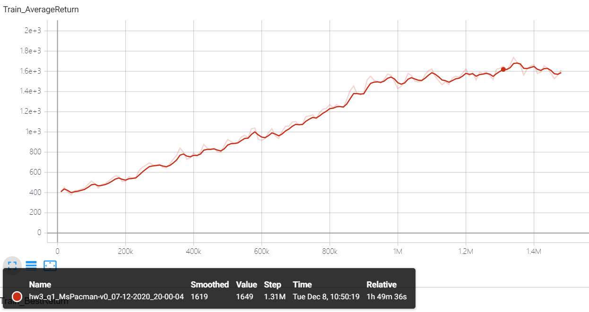
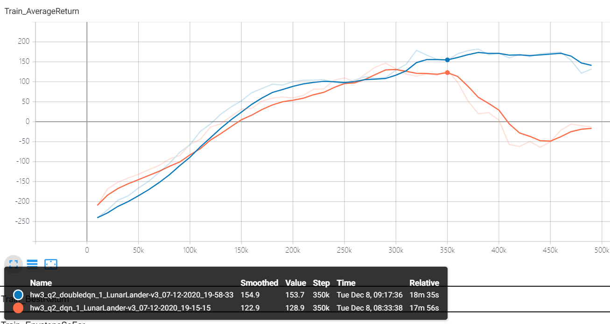
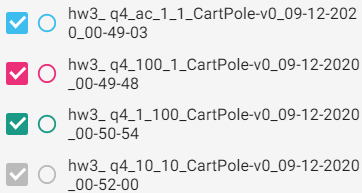
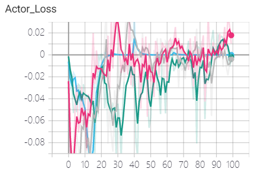
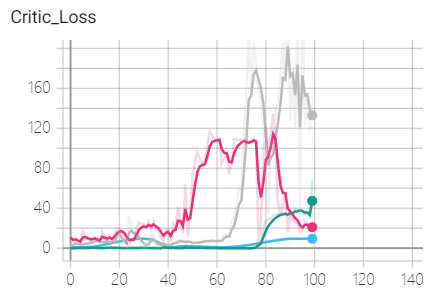
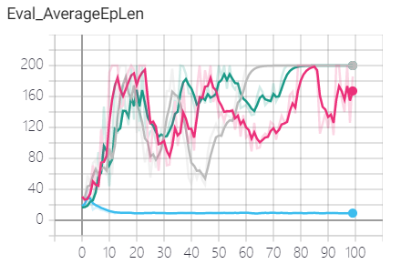

## DQN & AC/pytorch

#### **1.完成code**

重新pip install -e .

- ##### DQN

  **infrastructure/rl_trainer**

  ```python
  for itr in range(n_iter):
      self.agent.step_env()
      self.train_agent()
      
  def train_agent(self):
      for train_step in range(num_agent_train_steps_per_iter):
      	self.agent.sample()
      	self.agent.train(ob_batch, ac_batch, re_batch, next_ob_batch, terminal_batch)
  ```

  **agents/dqn_agent**

  ```python
  def step_env():
      # TODO use epsilon greedy exploration when selecting action
      action = self.actor.get_action(self.replay_buffer.encode_recent_observation())
      
  def train(self, ob_no, ac_na, re_n, next_ob_no, terminal_n):
      self.critic.update(ob_no, ac_na, next_ob_no, re_n, terminal_n)
  ```

  **policies/argmax_policy**

  继承自critic，与MLP无关

  ```python
  def get_action(self, obs):
      #类型转换
  ```

  **critics/dqn_critic**

  ```python
  def update(self, ob_no, ac_na, next_ob_no, reward_n, terminal_n)
  ```

- ##### AC

  **infrastructure/rl_trainer**

  删掉load from expert_data

  ```python
  for iter in range(n_iter):
      paths = self.collect_training_trajectories()
      self.agent.add_to_replay_buffer(paths) #replay_buffer.add_rollouts(paths)
      self.train_agent()
      
  def train_agent(self):
      for train_step in range(num_agent_train_steps_per_iter):
      	self.agent.sample()
      	self.agent.train(ob_batch, ac_batch, re_batch, next_ob_batch, terminal_batch)
  ```

  **agents/ac_agent**

  ```python
  def train():
      #update the critic
      #estimate_advantage
      #update the actor
  
  def estimate_advantage():
      
  ```

  **critics/bootstrap_continuous_critic**

  ```python
  def update(self, ob_no, ac_na, next_ob_no, reward_n, terminal_n):
      '''
      In theory, we need to perform this minimization every time we update our policy, so that our value function matches the behavior of the new policy. In practice however, this operation can be costly, so we may instead just take a few gradient steps at each iteration. Also note that since our target values are based on the old value function, we may need to recompute the targets with the updated value function, in the following fashion: 
      1. Update targets with current value function
      2. Regress onto targets to update value function by taking a few gradient steps
      3. Redo steps 1 and 2 several times
      '''
      #翻译过来就是，本来应该：更新一次policy，去环境里采一次batch，更新一次value function -> 更新一次policy
      #但是太慢了...
      #于是改成：更新多次policy，去环境里采一次batch，更新多次value function -> 更新多次policy
      
      '''以及此处可以重新讲一下forward'''
      python cs285/scripts/run_hw2.py --env_name CartPole-v0 -n 100 -b 1000 -dsa --exp_name q1_sb_no_rtg_dsa
  ```

  问题：

  version1：

  ```python
          for update_iter in range(self.num_target_updates):
              v_next = self(next_ob_no)
              target = reward_n + self.gamma * v_next * (1 - terminal_n)
              for grad_iter in range(self.num_grad_steps_per_target_update):
                  value = self(ob_no)
                  assert value.shape == target.shape
                  loss = self.loss(value, target)
  
                  self.optimizer.zero_grad()
                  loss.backward(retain_graph=True)
                  self.optimizer.step()
  ```

  ```bash
  RuntimeError: one of the variables needed for gradient computation has been modified by an inplace operation: [torch.cuda.FloatTensor [64, 1]], which is output 0 of TBackward, is at version 2; expected version 1 instead. Hint: enable anomaly detection to find the operation that failed to compute its gradient, with torch.autograd.set_detect_anomaly(True).
  ```

  version2：

  ```python
  				self.optimizer.zero_grad()
                  torch.autograd.set_detect_anomaly(True)
                  loss.backward(retain_graph=True)
  ```

  ```bash
  RuntimeError: one of the variables needed for gradient computation has been modified by an inplace operation: [torch.cuda.FloatTensor [64, 1]], which is output 0 of TBackward, is at version 2; expected version 1 instead. Hint: the backtrace further above shows the operation that failed to compute its gradient. The variable in question was changed in there or anywhere later. Good luck!
  ```

  ？？？？？？？？？？？？？？？

  version3:

  ```python
          for update_iter in range(self.num_target_updates):
              v_next = self(next_ob_no)
              target = reward_n + self.gamma * v_next * (1 - terminal_n)
              target = target.detach()
              for grad_iter in range(self.num_grad_steps_per_target_update):
                  value = self(ob_no)
                  assert value.shape == target.shape
                  loss = self.loss(value, target)
                  self.optimizer.zero_grad()
                  loss.backward()
                  self.optimizer.step()
  ```
  
  **policies/MLP_policy**

  ```python
class MLPPolicyAC(MLPPolicy)
  ```

#### 2.实验结果

- ##### DQN

  ​	To determine if your implementation of Q-learning is correct, you should run it with the default hyperparameters on the Ms. Pac-Man game for 1 million steps using the command below. Our reference solution gets a return of **1500** in this timeframe. On Colab, this will take roughly **3 GPU hours**.If it takes much longer than that, there may be a bug in your implementation.

  ​	Our reference solution with the default hyperparameters achieves around **150** reward after **350k** timesteps, but there is considerable variation between runs and without the double-Q trick the average return often **decreases** after reaching 150.

```bash
python cs285/scripts/run_hw3_dqn.py --env_name MsPacman-v0 --exp_name q1
```



```bash
python cs285/scripts/run_hw3_dqn.py --env_name LunarLander-v3 --exp_name q2_dqn_1 --seed 1
```

```bash
python cs285/scripts/run_hw3_dqn.py --env_name LunarLander-v3 --exp_name q2_doubledqn_1 --double_q --seed 1
```



- ##### AC

  ！！！！！！！！！！！！！！！！

  ​	In the example above, we alternate between performing one target update and one gradient update step for
  the critic. As you will see, this probably doesn't work, and you need to increase both the number of target
  updates and number of gradient updates.

  ！！！！！！！！！！！！！！！！

  ```bash
  python cs285/scripts/run_hw3_actor_critic.py --env_name CartPole-v0 -n 100 -b 1000 --exp_name q4_ac_1_1 -ntu 1 -ngsptu 1
  ```

  ```bash
  python cs285/scripts/run_hw3_actor_critic.py --env_name CartPole-v0 -n 100 -b 1000 --exp_name q4_100_1 -ntu 100 -ngsptu 1
  ```

  ```bash
  python cs285/scripts/run_hw3_actor_critic.py --env_name CartPole-v0 -n 100 -b 1000 --exp_name q4_1_100 -ntu 1 -ngsptu 100
  ```

  ```bash
  python cs285/scripts/run_hw3_actor_critic.py --env_name CartPole-v0 -n 100 -b 1000 --exp_name q4_10_10 -ntu 10 -ngsptu 10
  ```







